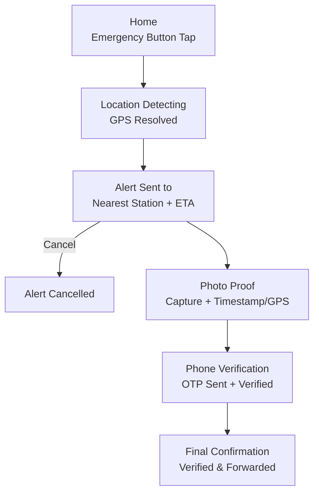

# SmartFlame — Emergency Fire Reporting App

SmartFlame is an Android application that lets bystanders and on-ground personnel report a fire in real time — detecting location, alerting the nearest fire station, capturing photo proof, and verifying the reporter via OTP — all optimized for one-handed use under stress.

Part of the larger **SmartFlame** system (AI-powered urban fire detection + autonomous drone response), this repo covers the **mobile app component** only.

---

## ✨ Features

- One-tap emergency trigger
- Automatic GPS location detection
- Nearest fire station lookup with ETA & distance
- Photo proof capture with timestamp + GPS overlay
- OTP-based reporter verification (anti-spam/false-alert safeguard)
- Real-time dispatch confirmation with responder details

---

## 🛠 Tech Stack

| Layer | Technology |
|---|---|
| Language | Kotlin |
| UI | Jetpack Compose (Material 3) |
| Location | FusedLocationProviderClient |
| Camera | CameraX |
| Navigation | Navigation Compose |
| Architecture | MVVM + Repository pattern |
| State Management | ViewModel + StateFlow |

---

## 📂 Project Structure

app/src/main/java/com/example/smartflame/
├── data/
│ ├── model/ # Plain data classes (LocationData, FireStation, AlertConfirmation)
│ ├── repository/ # Repository interfaces
│ └── repository/impl/ # Repository implementations (GPS + Mock)
├── viewmodel/ # EmergencyViewModel, EmergencyFlowState
└── ui/
├── screens/ # One composable per screen
└── components/ # Shared reusable composables

---

## 📱 App Flow



| Step | Screen | Action |
|---|---|---|
| 1 | Home | Emergency button trigger |
| 2 | Location Detecting | GPS resolved via `FusedLocationProviderClient` |
| 3 | Alert Sent Confirmation | Nearest station, ETA, distance shown; cancel option available |
| 4 | Photo Proof | Capture via CameraX, auto-stamped with timestamp + GPS |
| 5 | Phone Verification | 6-digit OTP sent and verified |
| 6 | Final Confirmation | Verified & forwarded to responders; call/exit options |

State is tracked via `EmergencyFlowState` (sealed class), scoped to a single `EmergencyViewModel` shared across the navigation graph.

---

## ⚙️ Setup Instructions

### Prerequisites
- **Android Studio** (Hedgehog or later recommended)
- **JDK 17** or higher
- **Android SDK** — minimum API level 26 (Android 8.0), target API level to match latest stable
- A physical device or emulator with:
  - Google Play Services (required for `FusedLocationProviderClient`)
  - Camera support (for CameraX features)

### 1. Clone the repository
```bash
git clone https://github.com/<your-org>/smartflame-app.git
cd smartflame-app
```

### 2. Open in Android Studio
- Launch Android Studio → **Open** → select the cloned project folder
- Let Gradle sync automatically (or trigger manually: **File → Sync Project with Gradle Files**)

### 3. Configure local environment
Create a `local.properties` file in the root directory (if not auto-generated) and set your SDK path:
```properties
sdk.dir=/path/to/your/Android/sdk
```

> **Note:** No API keys are required yet — all repositories (`Location`, `FireStation`, `Otp`, `Alert`) currently use mock implementations with simulated delays. Real backend/API keys will be added in a future integration phase.

### 4. Grant required permissions (on device/emulator)
The app will request the following at runtime:
- **Location** (fine + coarse) — for GPS detection
- **Camera** — for photo proof capture
- *(Phone number auto-read, if implemented, requires READ_PHONE_STATE — optional/fallback to manual entry)*

### 5. Build & Run
- Select a target device/emulator
- Click **Run ▶** or use:
```bash
./gradlew installDebug
```

### 6. Run tests
```bash
./gradlew test
```
